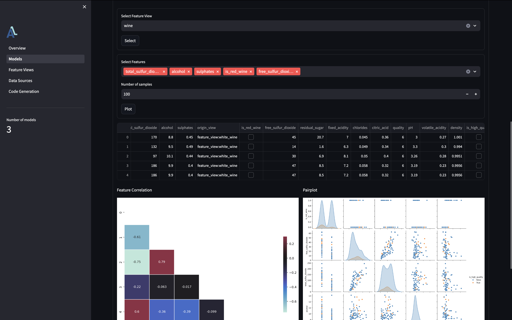
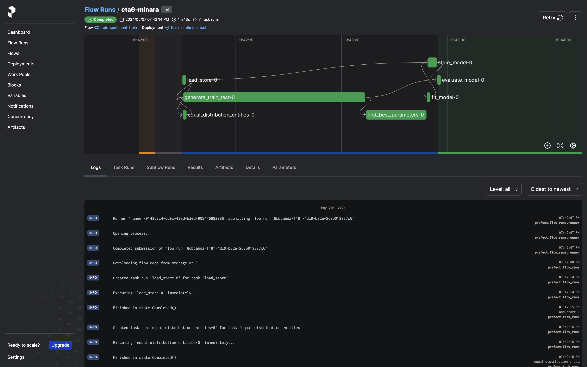
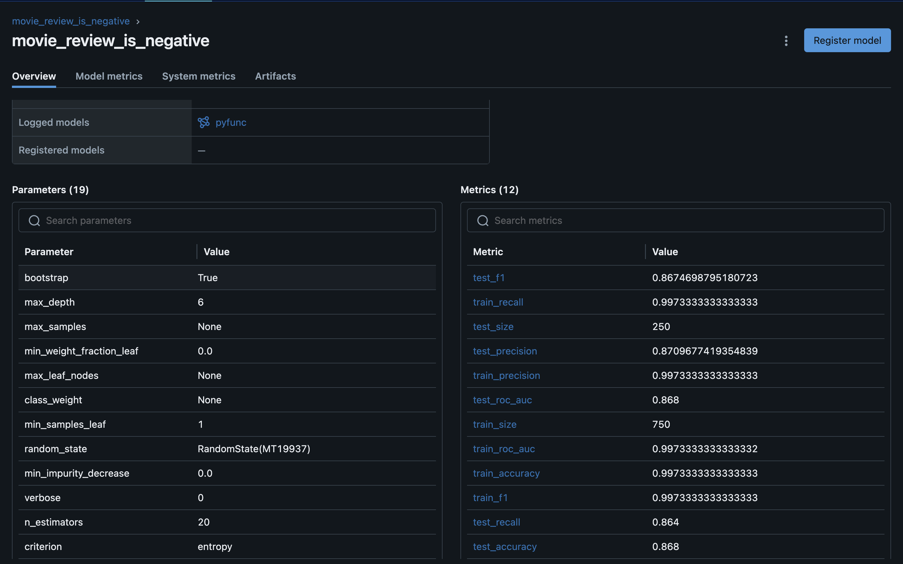
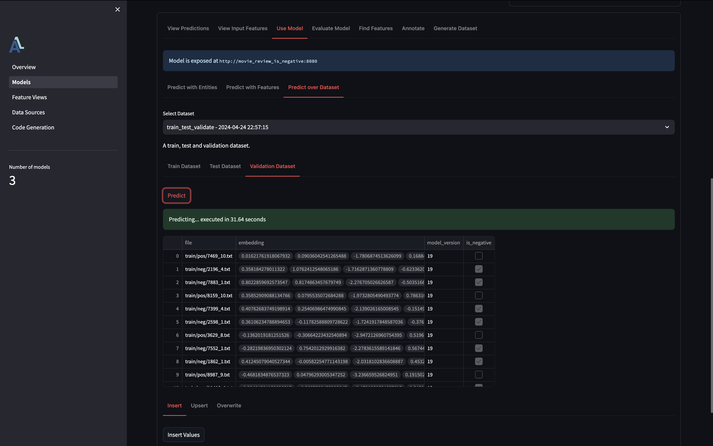
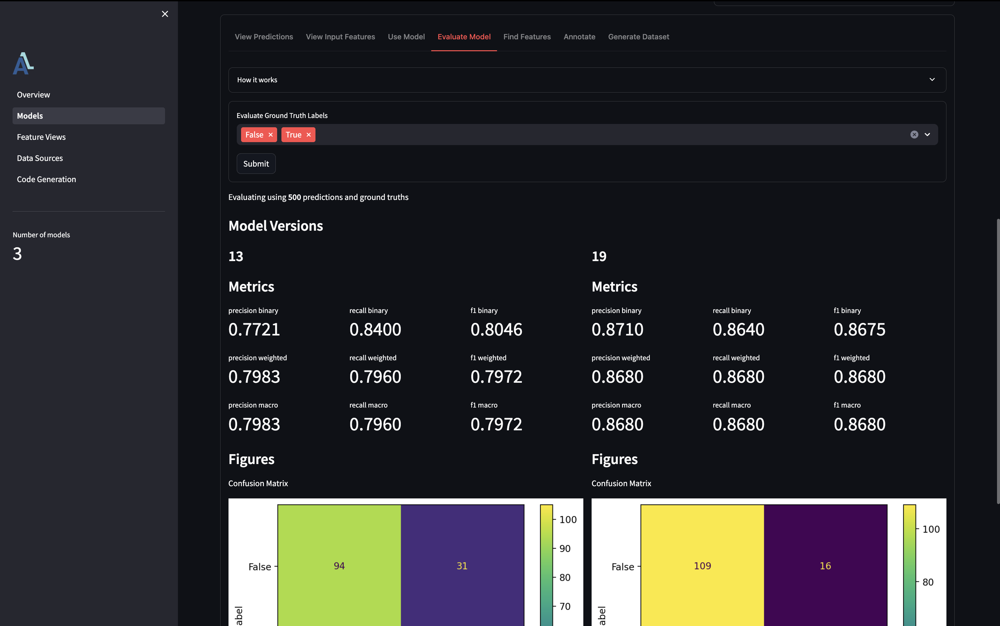

# ML Kickstarter

This is a kickstarter project for an end-to-end ML.

The goal of this project was to create the project structure that I would love to use my self.
Therefore, it is optimized for **local development** meaning faster iteration speed.

Furthermore, to make projects reliable, reproducable and easy to deploy will everything be developed through **Docker**, but with **hot reloading**. Meaning less build time and as a result faster iteration speeds.

## AI / ML Capabilities
- LLM / embedding server using Ollama
- Model experiment tracking using MLFLow
- Model regristry using MLFLow
- Model serving using MLFlow
- Model evaluation in production using Aligned
- Job orchestration using Prefect
- Data catalog using Aligned
- Data management using Aligned
- Data quality management using Aligned
- Data annotation using Aligned

## Software Development Capabilities
- Complete local development
- Containerized development for easier deployment
- Hot reload updatest to orchestation pipelines
- Hot reload model serving on promotion
- CI with unit and integration test on PRs
- CI warning for potential drift detection

## Intended Development Flow

When starting a new AI project, here is the intended development flow.

### 1. Spin up the infra
First we need to start the needed infrastructure to experiment and run our projects.

Run `make infra-up` this spins up the following:
- `prefect` as the orchetrator that trigger training pipelines. [http://127.0.0.1:4201](http://127.0.0.1:4201)
- `prefect-worker` local workers that run the pipelines. Reloads on file saves.
- `mlflow` as the model registry and the experiment tracker. [http://127.0.0.1:7050](http://127.0.0.1:7050)
- `aligned` as the data catalog and data / ml monitoring. [http://127.0.0.1:9000](http://127.0.0.1:9000)

You are now ready to develop a new model.

### 2. Formulate the AI problem, and the expected AI output.

E.g. if we want to predict if a review is either positive or negative, it could look something like the following:

```python
from aligned import String, Bool, model_contract

@model_contract(
    name="movie_review_is_negative",
    input_features=[] # Unclear for now
)
class MovieReviewIsNegative:
    review_id = String().as_entity()
    model_version = String()
    predicted_is_negative = Bool()
```

> [!NOTE]
> Currently the setup assumes that all ML contracts and views are placed in a file called `contract.py`. However this can be changed by chainging the `src/load_store.py` file.

### 3. Find relevant features.
We can use the aligned UI to find which features that could be interesting for our ML use-case.



This assumes that you have told aligned which data to use as the ground truth, which can be done with `.as_classification_label()`.

```python
@feature_view(...)
class MovieReview:
    review_id = String().as_entity()
    review = String()
    is_negative = Bool()

@model_contract(...)
class MovieReviewIsNegative:
    review_id = String().as_entity()
    predicted_is_negative = (
        MovieReview().is_negative
            .as_classification_label()
    )
```

We can now add the intended features into the contract, but listing them, or the full feature view in the `input_feature` attribute. And it is also possible to have differnet versions of input, incase the input changes over time.

```python
wine_features = Wine()

@model_contract(
    name="wine_is_high_quality",
    input_features=[
        wine_features.is_red_wine,
        wine_features.alcohol,
        ...
    ]
)
class WineIsHighQuality:
    ...
```

### 4. Create a training pipeline

Create your own pipeline logic, or maybe reuse the generic classification pipeline, `classifier_from_train_test_set` which is located at `src/pipelines/train.py`.

Remember to add the pipeline to `src/pipelines/available.py` to make it visible in the Prefect UI.

### 5. Train the model

Train the model by using the Prefect UI.



### 6. Manage the Models

View training runs and manage which models should be deployed, through MLFlow.



### 7. Spin up a serving end-point

Figure out what the url of the model is and serve the ML model.

View the `wine-model` in `docker-compose.yaml` for an example.

### 8. Use the model

To use the model, update our `model_contract` once more with where the model is exposed, and where we want to store the predictions.

Make sure you have started the models with `make models-up`.
This will reload the models when you promote a new model.

Then we can predict over different datasets, or manually inputted data.



```python
from aligned import FileSource, ...
from aligned.exposed_model.mlflow import mlflow_server

@model_contract(
    name="movie_review_is_negative",
    input_features=[...],
    exposed_at=mlflow_server(
        host="http://my-docker-service-name:8080",

        # Used to figure out which model version produced the prediction
        model_name="movie_review_is_negative",
        model_alias="champion"
    ),
    output_source=FileSource.csv_at("online_preds/movie_review_is_negative.csv"),
    dataset_store=FileSource.json_at("datasets/movie_review_is_negative.json")
)
class MoviewReviewIsNegative:
    review_id = String().as_entity()
    model_version = String().as_model_version()
    predicted_is_negative = (
        MovieReview().is_negative
            .as_classification_label()
    )
```

### 9. Evaluate Online Predictions
Lastly, we can start evaluating online predictions whenever we recive new ground truth values.

This can also be done through the aligned UI in the evaluation tab.
Here can different models also be compared against each other if you have added the `as_model_version()` in the model contract.

```python
@model_contract(...)
class MoviewReviewIsNegative:
    review_id = String().as_entity()
    model_version = String().as_model_version()
    ...
```



## Other make commands

This projects contain a simple `Makefile` to simplify the development.

### `make models-up`
Spins up the differnet trained MLFlow models.

- Spins up the `wine_model` if trained and annotated as `champion` - can be done through `make train`
- Spins up the `movie_review_is_negative` if trained and annotated as `champion` - can be done through `make train`

### `make ollama`

Spins up the Ollama server and pulls an embedding model down.
If you run on MacOS, it is recommended to run the ollama server ouside of docker, as that enables the GPU.

### `make test`
Runs all tests in the `tests` dir, both unit tests, and integration tests if you have them.

### `make build`
Rebuilds all images if needed.

### `make clean`
Removes all unused docker images.
